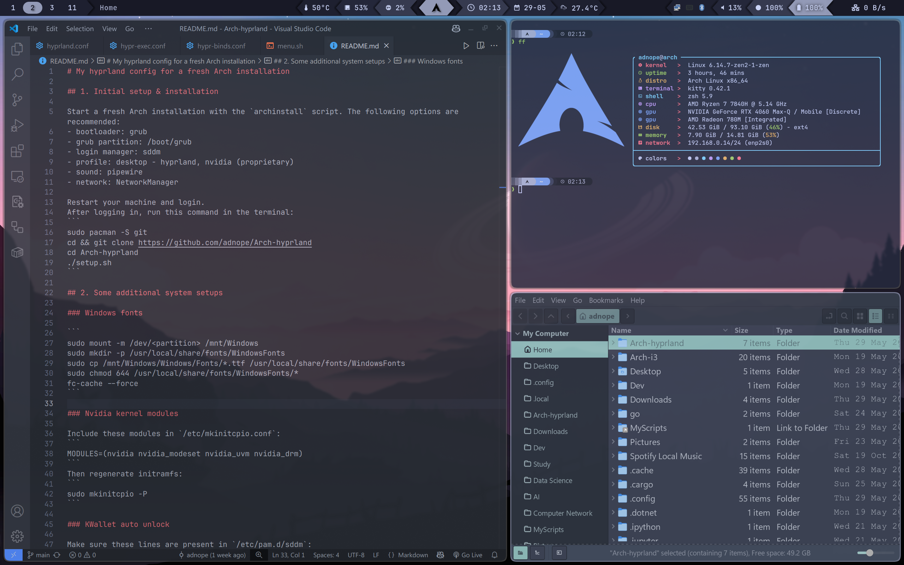

# My hyprland config for a fresh Arch installation



## 1. Initial setup & installation

Start a fresh Arch installation with the `archinstall` script. The following options are recommended:
- bootloader: grub
- grub partition: /boot/grub
- login manager: sddm
- profile: desktop - hyprland, nvidia (proprietary)
- sound: pipewire
- network: NetworkManager

Restart your machine and login.
After logging in, run this command in the terminal:
```
sudo pacman -S git
cd && git clone https://github.com/adnope/Arch-hyprland
cd Arch-hyprland
./setup.sh
```

## 2. Some additional system setups

### Windows fonts

```
sudo mount -m /dev/<partition> /mnt/Windows
sudo mkdir -p /usr/local/share/fonts/WindowsFonts
sudo cp /mnt/Windows/Windows/Fonts/*.ttf /usr/local/share/fonts/WindowsFonts
sudo chmod 644 /usr/local/share/fonts/WindowsFonts/*
fc-cache --force
```

### Nvidia kernel modules

Include these modules in `/etc/mkinitcpio.conf`:
```
MODULES=(nvidia nvidia_modeset nvidia_uvm nvidia_drm)
```
Then regenerate initramfs:
```
sudo mkinitcpio -P
```

### KWallet auto unlock

Make sure these lines are present in `/etc/pam.d/sddm`:
```
auth            optional        pam_kwallet5.so
session         optional        pam_kwallet5.so auto_start
```

### Swapfile & Hibernation

Some [instructions](https://wiki.archlinux.org/title/Swap#Swap_file_creation) to create a swapfile from the ArchWiki:
```
# 15897128960 bytes equal 14 GiB or 16GB
sudo mkswap -U clear --size 15897128960 --file /swapfile
sudo swapon /swapfile
sudo echo "/swapfile none swap defaults 0 0" >> /etc/fstab
```

Add the `resume` hook to initramfs config:
```
# /etc/mkinitcpio.conf
HOOKS=(...block resume filesystems...)
```

Add the resume and resume_offset parameters to the grub config:
```
# /etc/default/grub
GRUB_CMDLINE_LINUX_DEFAULT="loglevel=3 quiet resume=UUID=123456 resume_offset=123456"
```

The UUID is the UUID of the partition containing the swapfile and can be retrieved with:
```
lsblk -f
```

Get the offset parameter with this command:
```
sudo filefrag -v /swapfile | awk '$1=="0:" {print substr($4, 1, length($4)-2)}'
```